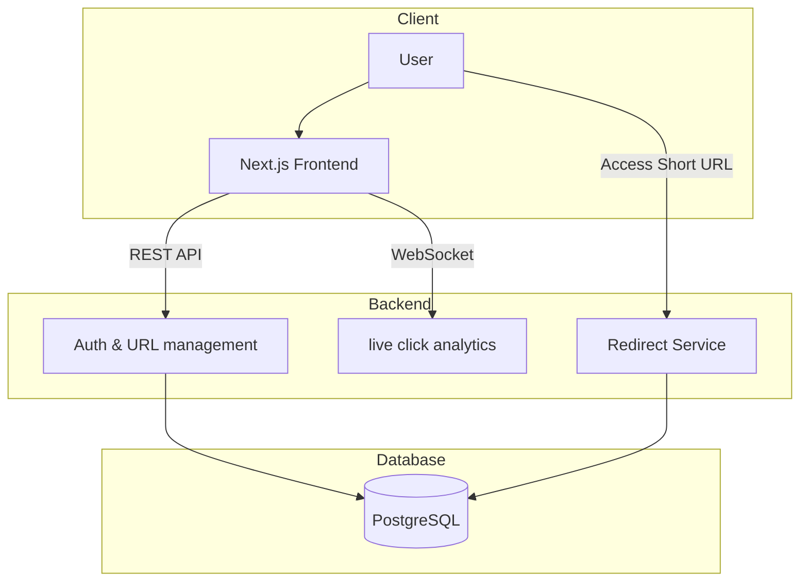

# Urler | URL Analytics Platform

**Urler** is a full-stack web application for shortening long URLs and tracking their usage with real-time analytics. It provides a clean, intuitive interface for creating short links and monitoring their performance.

* **URL Shortening** – Convert long URLs into short, easy-to-share links.
* **Click Tracking** – Capture every click on shortened URLs.
* **Analytics Dashboard** – View click metrics updated in real time.
* **User Authentication** – Securely manage links under individual accounts.

## the tech stack

### backend

* **framework:** Spring Boot
* **language:** Java
* **real-time communication:** WebSockets
* **security:** Spring Security + JWT

### frontend

* **framework:** Next.js (React)
* **language:** TypeScript

### infrastructure

* **database:** PostgreSQL
* **containerization:** Docker

## architecture



## starting application

### prerequisites

* Node.js (>=18)
* Java (>=17)
* Docker (optional, for containerized deployment)

### installation

1. **clone the repository**

   ```bash
   git clone https://github.com/byuly/Urler.git
   cd urler
   ```

2. **frontend setup**

   ```bash
   cd frontend
   npm install
   npm run dev
   ```

3. **backend setup**

   ```bash
   cd backend
   ./mvnw spring-boot:run
   ```

4. **(optional) run with docker**

   ```bash
   docker-compose up --build
   ```
   
5. **(optional) to run tests**
   ```bash
   ./mvnw test
   ```
