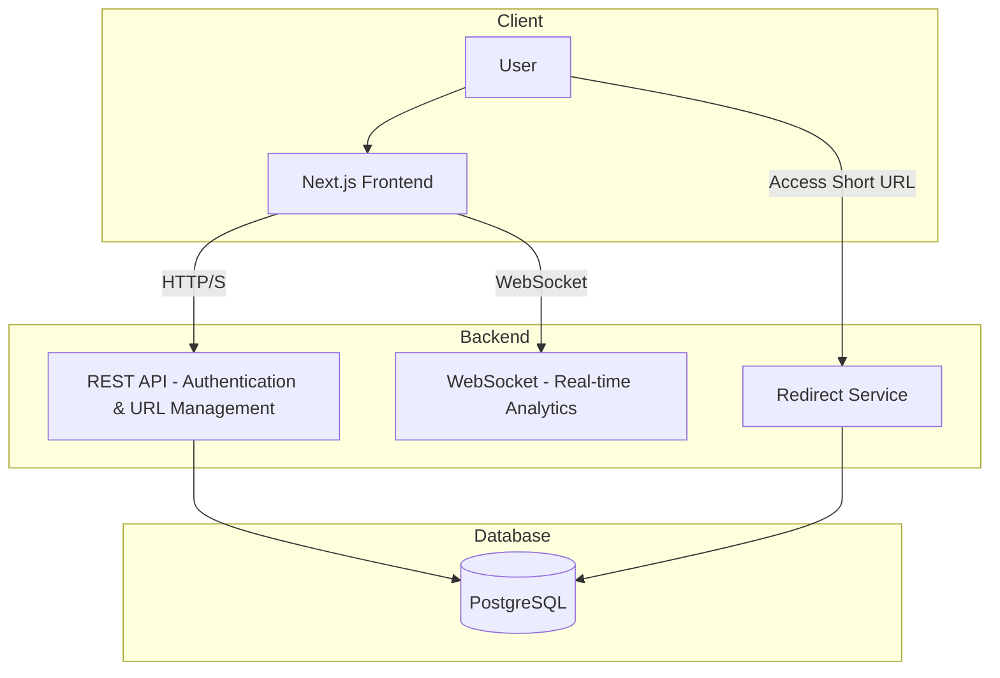

# Urler | URL Analytics Platform

**Urler** is a full-stack web application for shortening long URLs and tracking their usage with real-time analytics. It provides a clean, intuitive interface for creating short links and monitoring their performance.

## 🚀 Features

* **URL Shortening** – Convert long URLs into short, easy-to-share links.
* **Click Tracking** – Capture every click on shortened URLs.
* **Analytics Dashboard** – View click metrics updated in real time.
* **User Authentication** – Securely manage links under individual accounts.

## 😲 Tech Stack

### Frontend

* **Framework:** Next.js (React)
* **Language:** TypeScript

### Backend

* **Framework:** Spring Boot
* **Language:** Java
* **Real-time Communication:** WebSockets
* **Security:** Spring Security + JWT

### Infrastructure

* **Database:** PostgreSQL
* **Containerization:** Docker

## Architecture



## 📦 Getting Started

### Prerequisites

* Node.js (>=18)
* Java (>=17)
* Docker (optional, for containerized deployment)

### Installation

1. **Clone the repository**

   ```bash
   git clone https://github.com/your-username/urler.git
   cd urler
   ```

2. **Frontend Setup**

   ```bash
   cd frontend
   npm install
   npm run dev
   ```

3. **Backend Setup**

   ```bash
   cd backend
   ./mvnw spring-boot:run
   ```

4. **(Optional) Run with Docker**

   ```bash
   docker-compose up --build
   ```
* [ ] Export analytics reports

## 📝 License

This project is licensed under the [MIT License](LICENSE).
